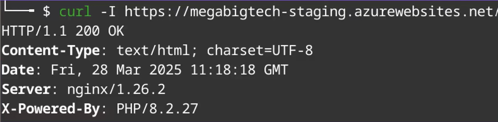

# Azure Web Apps
This folder is used to track resources, scripts, and cheatsheets related to Azure Web Apps (App Services).

---

## Fingerprinting an Azure Web App

Use `curl -I` to fetch HTTP response headers and identify Azure-hosted web apps:

```bash
curl -I "https://<app-name>.azurewebsites.net/"
```

**Key indicators:**
- Domain ends in `.azurewebsites.net`
- `Server` header reveals the web server (e.g., `nginx/1.26.2`)
- `X-Powered-By` header leaks the runtime and version (e.g., `PHP/8.2.27`)



## Web App Remote Code Execution
**Nested Commands to Obtain Remote Code Execution:**

