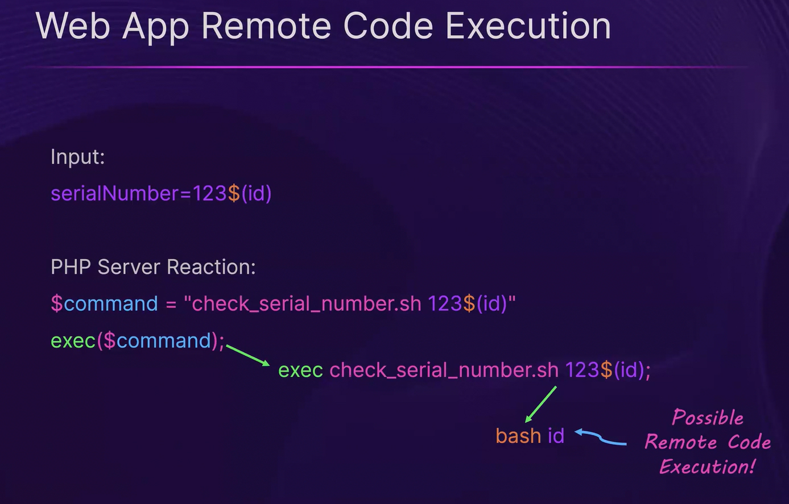

# Azure Web Apps
This folder is used to track resources, scripts, and cheatsheets related to Azure Web Apps (App Services).

---

## Fingerprinting an Azure Web App

Use `curl -I` to fetch HTTP response headers and identify Azure-hosted web apps:

```bash
curl -I "https://<app-name>.azurewebsites.net/"
```

**Key indicators:**
- Domain ends in `.azurewebsites.net`
- `Server` header reveals the web server (e.g., `nginx/1.26.2`)
- `X-Powered-By` header leaks the runtime and version (e.g., `PHP/8.2.27`)


## Web App Remote Code Execution

OS command injection occurs when user-supplied input is passed unsanitized into system commands. Azure Web Apps running PHP (or other server-side languages) that use functions like `exec()`, `system()`, or `shell_exec()` with user input are vulnerable.

### How It Works

1. The application accepts a user-controlled parameter (e.g., `serialNumber`)
2. The value is concatenated directly into a shell command without sanitization
3. An attacker injects a shell sub-expression like `$(id)` into the parameter
4. The server-side code passes the payload to `exec()`, which the shell interprets and executes

**Example payload:**

```
serialNumber=123$(id)
```

**Server-side PHP (vulnerable):**

```php
$command = "check_serial_number.sh 123$(id)";
exec($command);
// Shell interprets $(id) → executes `id` command → Remote Code Execution
```



### Exploitation Tips

- **Identify injectable parameters** — look for input fields that interact with server-side scripts or system utilities
- **Test with simple commands** — start with `$(id)`, `$(whoami)`, or `$(hostname)` to confirm execution
- **Escalate** — once RCE is confirmed, pivot to reading environment variables (`$(env)`), accessing managed identity tokens, or establishing a reverse shell
- **Azure-specific targeting** — on Azure Web Apps, use RCE to query the Instance Metadata Service (IMDS) for managed identity tokens:

```bash
curl -H "Metadata: true" "http://169.254.169.254/metadata/identity/oauth2/token?api-version=2018-02-01&resource=https://management.azure.com/"
```

### Common Vulnerable Functions by Language

| Language | Dangerous Functions |
|---|---|
| PHP | `exec()`, `system()`, `shell_exec()`, `passthru()`, `popen()` |
| Python | `os.system()`, `subprocess.call()`, `subprocess.Popen()` |
| Node.js | `child_process.exec()`, `child_process.spawn()` |
| .NET | `Process.Start()`, `System.Diagnostics.Process` |

